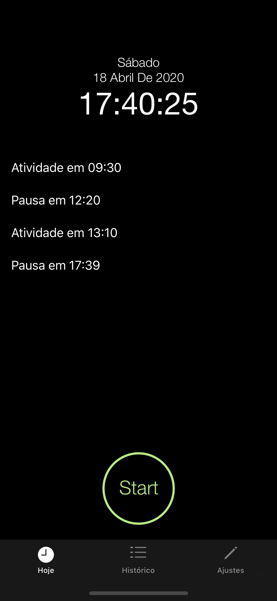
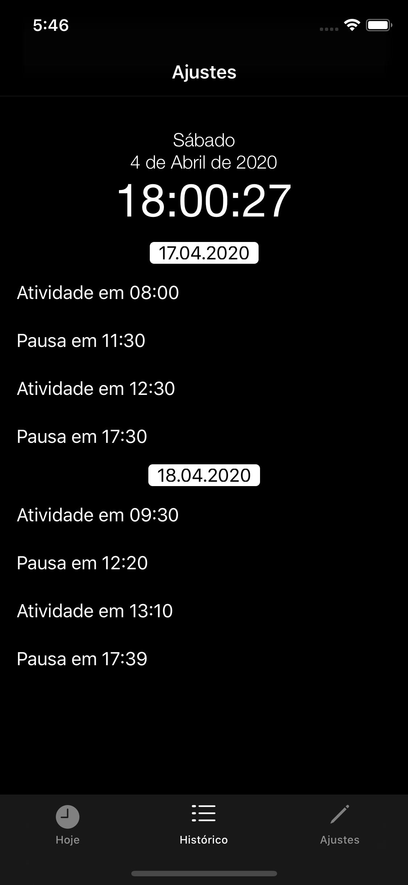

# Swiftime

Swift is an application to manage your time while working, designed to help you organize your time at work at home, since because of this pandemic COVID-19 many people started working at home.

## How it works? ##

Swiftime is currently a time control that starts and ends your tasks, all information is saved in Firebase, so you will not lose your data when switching devices

there are two main screens, the screen with your current day's schedules, and a history screen, where you can view all the times recorded using Swiftime.

current features only include the start and pause registration of activities, among the improvements, the extension for AppleWatch will be added, making it easier to register your tasks.

As all information is being saved in Firebase, I would also like to enable the user to generate a graph based on this information, such as how many hours of activity per week, a timesheet that could be shared by email in the form of PDF, it would also be nice to have a feature for the user to enter the cost of his hour to callcular in cash how much his hourly work is worth.
